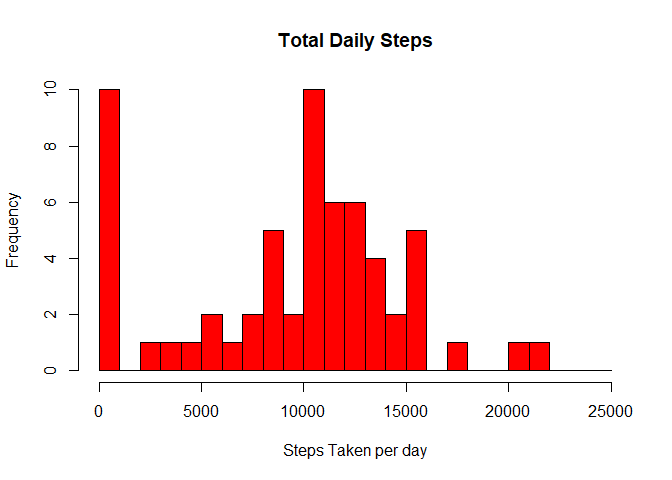
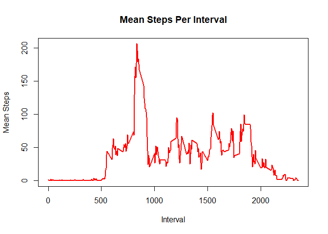
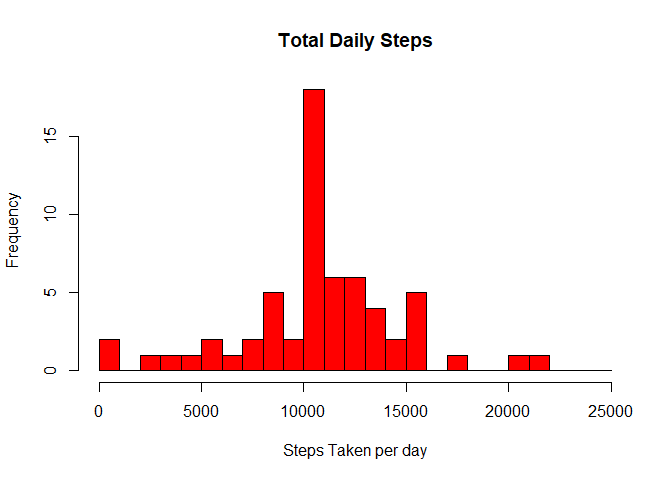
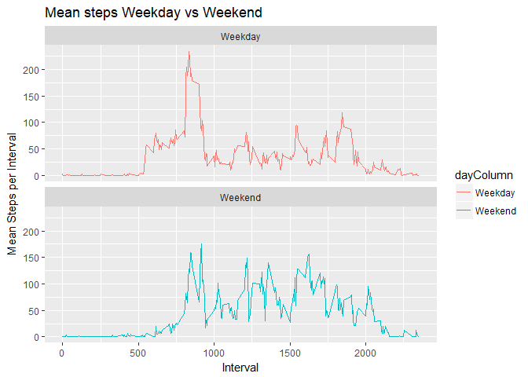

# Reproducible Research: Peer Assessment 1
Will G  


## Loading and preprocessing the data

```r
knitr::opts_chunk$set(echo = TRUE)
```

Loading CSV from directory
As per github directory, the .Rmd file and activity.csv should be in the same place

```r
activityFile <- read.csv("./activity.csv")
```


## What is mean total number of steps taken per day?


```r
dailySteps <- with(activityFile, aggregate(steps, by = list(date), FUN = sum, na.rm = TRUE))
names(dailySteps) <- c("date", "steps")

hist(dailySteps$steps, main = "Total Daily Steps", col="red", xlab = "Steps Taken per day" , breaks = seq(0,25000, by = 1000))
```

<!-- -->

```r
meanDailySteps <- mean(dailySteps$steps)

medianDailySteps <- median(dailySteps$steps)
```
Mean Daiy Steps


```r
print(meanDailySteps)
```

```
## [1] 9354.23
```
Median Daily Steps

```r
print(medianDailySteps)
```

```
## [1] 10395
```
## What is the average daily activity pattern?


```r
dailyActivity <- aggregate(activityFile$steps, by = list(activityFile$interval), FUN = mean, na.rm = TRUE)
names(dailyActivity) <- c("interval", "meanSteps")
plot(dailyActivity$interval, dailyActivity$meanSteps, type = "l", col="red", lwd = 2, ylab="Mean Steps", xlab="Interval", main="Mean Steps Per Interval")
```

<!-- -->

Max number of steps per 5 minute interval

```r
maxVector <- dailyActivity[which.max(dailyActivity$meanSteps),]
maxValue <- maxVector$interval
print(maxValue)
```

```
## [1] 835
```

## Imputing missing values
The missing values for each interval are replaced by the average value for the respective interval 

Number of missing values

```r
naVals <- sum(is.na(activityFile$steps))
print(naVals)
```

```
## [1] 2304
```

Imputing missing values


```r
meanStepsImputed <- dailyActivity$meanSteps[match(activityFile$interval, dailyActivity$interval)]

activityFileNoNa <- transform(activityFile, steps = ifelse(is.na(activityFile$steps), yes = meanStepsImputed, no = activityFile$steps))

dailyStepsNoNa <- aggregate(steps ~ date, activityFileNoNa, sum)
names(dailyStepsNoNa) <- c("date", "steps")

hist(dailyStepsNoNa$steps, main = "Total Daily Steps", col="red", xlab = "Steps Taken per day" , breaks = seq(0,25000, by = 1000))
```

<!-- -->

```r
meanDailyStepsNoNa <- mean(dailyStepsNoNa$steps)

medianDailyStepsNoNa <- median(dailyStepsNoNa$steps)
```

Mean Daiy Steps Imputed


```r
print(meanDailyStepsNoNa)
```

```
## [1] 10766.19
```

Median Daily Steps Imputed


```r
print(medianDailyStepsNoNa)
```

```
## [1] 10766.19
```

These values are the same, and are different from the mean/median without the imputed values. Adding in the mean value for each interval cleans up the dataset and makes it fit a normal distribution. 
## Are there differences in activity patterns between weekdays and weekends?
A column was added called dayCOlumn which converts a date value to a value of weekday or weekend


```r
library(ggplot2)

activityFileDays <- activityFile

activityFileDays$date <- as.POSIXct(activityFileDays$date) 

dayColumn <- weekdays(activityFileDays$date)

activityFileDays <- cbind(activityFileDays, dayColumn)


isWeekend <- function(x) {
  dayType <- x
  
  if (x %in% c("Saturday", "Sunday"))
    return("Weekend")
  else
    return("Weekday")
}

activityFileDays$dayColumn <- sapply(activityFileDays$dayColumn, FUN=isWeekend)

activityFileDaysNoNa <- aggregate(activityFileDays$steps~activityFileDays$interval + activityFileDays$dayColumn, activityFileDays, mean, na.rm = TRUE)
names(activityFileDaysNoNa) <- c("interval", "dayColumn", "steps")


weekdayPlot <- ggplot(activityFileDaysNoNa, aes(x=interval, y=steps,colour=dayColumn )) + geom_line() + labs(title="Mean steps Weekday vs Weekend", x="Interval", y="Mean Steps per Interval") + facet_wrap(~dayColumn, ncol=1, nrow=2)

print(weekdayPlot)
```

<!-- -->
